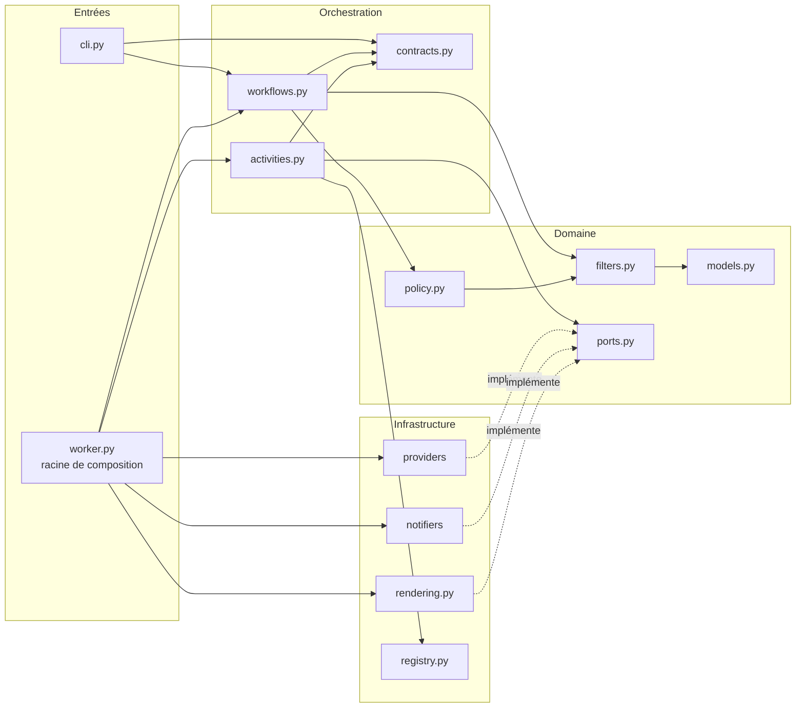

# Architecture

Rendez-vite suit une architecture hexagonale. Le **domaine** porte les règles métier et ne dépend d'aucun framework. L'**orchestration** confie à Temporal la question du *quand*. L'**infrastructure** branche le domaine sur le monde extérieur (API, SMTP).

## Organisation du code

```text
src/rendez_vite/
├── domain/                 Cœur métier, sans I/O
│   ├── models.py           Entités et objets valeur : AppointmentSlot, SearchCriteria…
│   ├── filters.py          Une règle de sélection par critère, composables
│   ├── policy.py           Décision d'une vérification : quoi annoncer, faut-il s'arrêter
│   ├── ports.py            Interfaces attendues : SlotProvider, NotificationSender, AlertRenderer
│   └── errors.py           Hiérarchie d'exceptions
├── infrastructure/         Adaptateurs
│   ├── providers/          fake (démonstration), http (API JSON)
│   ├── notifiers/          console, smtp
│   ├── rendering.py        Mise en forme de l'e-mail
│   └── registry.py         Sélection d'un adaptateur par son nom
├── orchestration/          Temporal
│   ├── contracts.py        Noms et charges utiles partagés (workflow ↔ activités ↔ clients)
│   ├── workflows.py        Boucle de surveillance
│   ├── activities.py       Seul point de contact du workflow avec l'extérieur
│   ├── worker.py           Racine de composition : assemble les adaptateurs
│   └── client.py           Connexion au serveur Temporal
├── config.py               Paramètres (variables d'environnement, .env)
├── cli.py                  Ligne de commande
└── __main__.py             python -m rendez_vite
```

## Dépendances entre couches



Les dépendances vont toujours vers le domaine. Le workflow ne connaît que le **contrat** des activités (leurs noms et leurs charges utiles), jamais leur implémentation.

## Application des principes SOLID

| Principe | Mise en œuvre |
|---|---|
| **S** : responsabilité unique | Chaque classe a une seule raison de changer. Un filtre par critère (`WeekdayFilter`, `HorizonFilter`…), `SlotWatchPolicy` décide, `PlainTextAlertRenderer` met en forme, `SmtpEmailNotifier` envoie, `HttpSlotProvider` interroge, le workflow planifie. |
| **O** : ouvert/fermé | Un nouveau critère s'ajoute par une fabrique dans `FILTER_FACTORIES`. Un nouveau service de réservation ou canal s'enregistre dans un `ComponentRegistry`. Le code existant n'est pas modifié. |
| **L** : substitution de Liskov | Tout `SlotFilter` est interchangeable, y compris `AllOfFilter`, lui-même un filtre. `FakeSlotProvider` et `HttpSlotProvider` passent par la même activité ; les tests remplacent les adaptateurs par des doublures sans rien changer. |
| **I** : ségrégation des interfaces | Les ports sont minimaux : une méthode chacun (`fetch_slots`, `send`, `render`, `matches`). |
| **D** : inversion des dépendances | Le domaine définit les ports et l'infrastructure les implémente. `AppointmentActivities` reçoit ses registres et son moteur de rendu par injection. Seul `worker.py` assemble les implémentations concrètes. |

## Choix structurants

- **Filtrage dans le workflow.** Les règles sont pures et déterministes : elles s'exécutent dans le workflow, ce qui rend chaque décision visible et rejouable dans l'historique Temporal. Seules les entrées/sorties passent par des activités.
- **Charges utiles en `dataclass`.** Le convertisseur par défaut de Temporal les sérialise nativement, dates et énumérations comprises. Pydantic n'est utilisé que pour la configuration.
- **Instants absolus, fuseau explicite.** Les créneaux portent des dates avec fuseau. Jours et heures sont évalués dans le fuseau IANA de l'utilisateur. Le paquet `tzdata` rend ce comportement identique sur toutes les plateformes.
- **Rendu indépendant de la locale.** Les noms de jours et de mois sont codés en dur, pour produire le même e-mail sur un poste et dans un conteneur.
