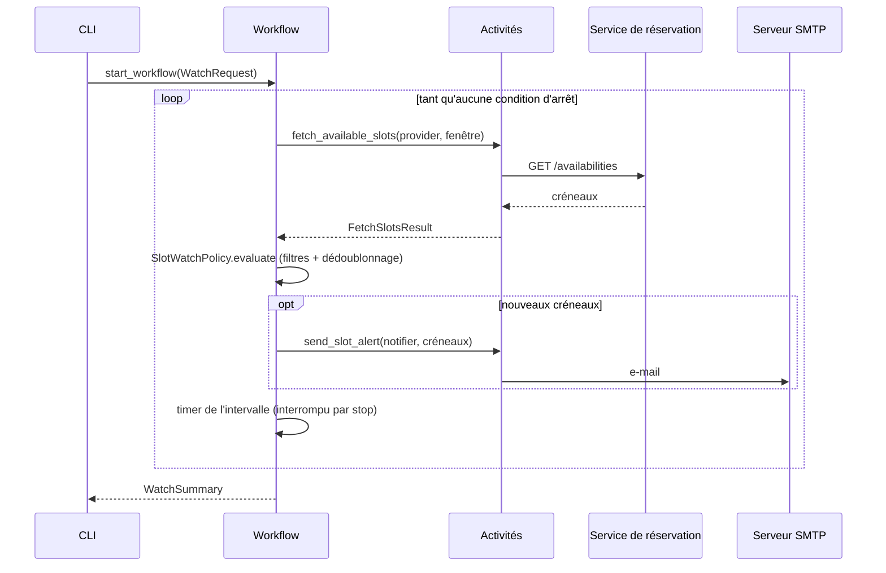
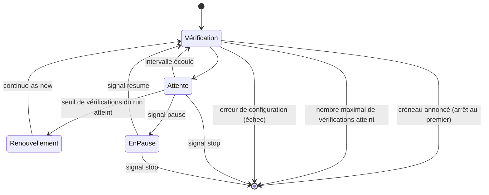

# Workflow Temporal

## Vue d'ensemble

| Élément | Nom Temporal | Rôle |
|---|---|---|
| Workflow | `RendezViteWatch` | Boucle de surveillance (`RendezViteWatchWorkflow`) |
| Activité | `fetch_available_slots` | Interroge un provider pour la fenêtre de recherche |
| Activité | `send_slot_alert` | Met en forme et envoie l'alerte |
| Signal | `pause`, `resume`, `stop` | Pilotage de la surveillance |
| Signal | `update_criteria` | Remplace les critères (charge utile `SearchCriteria`) |
| Requête | `status` | Instantané : compteurs, pause, dernière vérification, dernière erreur |
| File de tâches | `rendez-vite` (configurable) | Partagée par le workflow et les activités |

L'entrée du workflow est un `WatchRequest` : critères, destinataire, `WatchOptions` et `WatchState`. Il renvoie un `WatchSummary`. Ces types sont définis dans `orchestration/contracts.py`.

## Déroulement d'une vérification

## Cycle de vie

## Résilience

### Politiques de reprise

| Activité | Timeout (start-to-close) | Tentatives | Intervalle initial → maximal | Erreurs non réessayées |
|---|---|---|---|---|
| `fetch_available_slots` | 30 s | 5 | 5 s → 5 min | `ConfigurationError`, `UnknownComponentError` |
| `send_slot_alert` | 60 s | 10 | 10 s → 10 min | `ConfigurationError`, `UnknownComponentError` |

### Erreurs après épuisement des tentatives

- **Erreur transitoire** (service indisponible, SMTP refusé…) : l'erreur est journalisée et exposée par la requête `status`. La surveillance continue à l'intervalle suivant. Une panne passagère ne met donc pas fin à une surveillance de plusieurs mois.
- **Erreur de configuration** (provider ou notifier inconnu, critères invalides) : le workflow échoue immédiatement, car réessayer ne changerait rien.
- **Échec de notification** : les créneaux ne sont pas marqués comme annoncés. Ils seront proposés de nouveau à la vérification suivante.

### Arrêt et redémarrage du worker

L'état du workflow est reconstruit par rejeu de l'historique. Un timer en cours reprend là où il en était, sans double vérification.

## Surveillances longues : `continue-as-new`

Chaque vérification ajoute des événements à l'historique. Après `checks_before_continue_as_new` vérifications (200 par défaut), le workflow redémarre avec un historique vierge. Il transmet un `WatchState` contenant le nombre de vérifications et d'alertes et les créneaux déjà annoncés, ainsi que les critères éventuellement modifiés par signal.

Le renouvellement a lieu **après** l'attente de l'intervalle, et jamais pendant une pause ou une demande d'arrêt. La fréquence de vérification est ainsi respectée d'un run à l'autre.

## Contraintes de déterminisme

Le code du workflow est rejoué à chaque reprise. Il doit donc rester déterministe :

- l'heure courante provient de `workflow.now()`, jamais de `datetime.now()` ;
- le domaine est importé via `workflow.unsafe.imports_passed_through()`. Il est pur : ni I/O, ni aléatoire, ni horloge ;
- toute entrée/sortie passe par une activité.

**Attention lors d'une évolution des règles de filtrage.** Les filtres s'exécutent dans le workflow. Modifier leur comportement peut changer une décision passée lors du rejeu d'une surveillance en cours, et provoquer une erreur de non-déterminisme. Encadrez un tel changement avec `workflow.patched("nom-du-changement")`, ou laissez les surveillances en cours se terminer avant de déployer.
